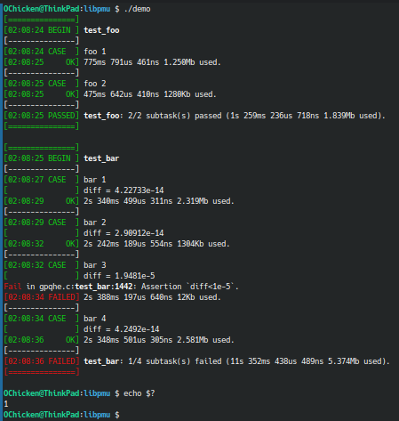

# libpmu

A performance monitoring unit.

## Usage

A sample test file looks like:

```c
#include "path/to/pmu.h"

#define CHECK_DIFF(m,m0)                       \
  TEST_PLACEHOLDER();                          \
  printf("diff = %g\n", distance((m), (m0)));  \
  ASSERT(diff<1e-5);

static void foo(int alg)
{
	/* do something */
}

static void bar(int alg)
{
	/* do something */
	CHECK_DIFF(m, m0);
}

static int test_foo()
{
TEST_BEGIN();

TEST_DO("foo 1");
	foo(1);
TEST_DONE();

TEST_DO("foo 2");
	foo(2);
TEST_DONE();

TEST_END();
	return TEST_ERR;
}

static int test_bar()
{
TEST_BEGIN();

TEST_DO("bar 1");
	bar(1);
TEST_DONE();

TEST_DO("bar 2");
	bar(2);
TEST_DONE();

TEST_END();
	return TEST_ERR;
}

int main(int argc, char *argv[])
{
	int err = 0;
	err |= test_foo();
	err |= test_bar();
	return err;
}
```

The output looks like:

  
